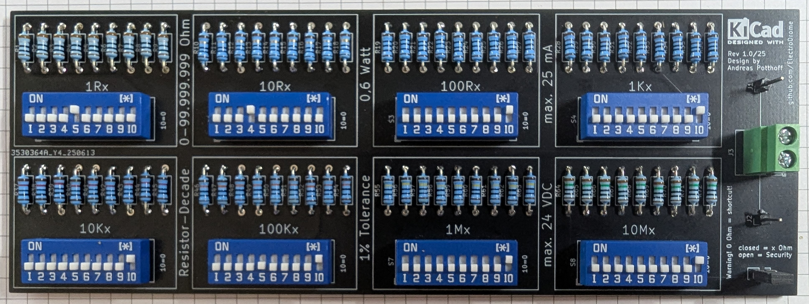
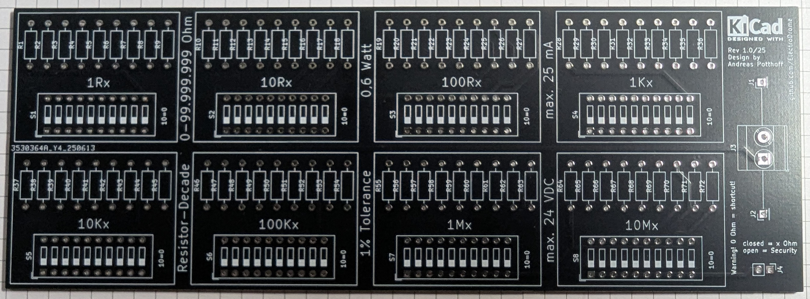
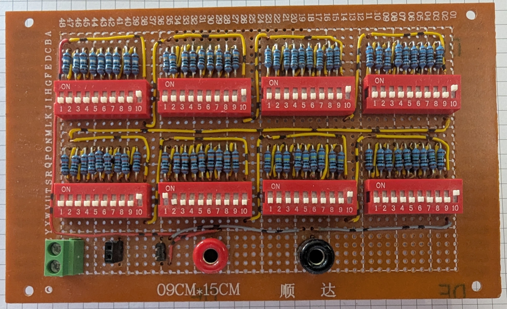

# 🧪 Lab Tool – DIP-Switch Precision Resistor Decade (Version 1.0/25)

/

---

## 📦 Project Overview

This DIP-switch-based precision resistor decade provides **8 stacked ranges** from **1 Ω to 99.999.999 Ω**, allowing granular resistance selection via binary-coded switches. Built with **Vishay 1% tolerance resistors (0.6 W)**, the module is ideal for prototyping, calibration, and analog simulation tasks. Ideal for analog testing, calibration workflows, and educational labs, this decade design emphasizes modularity, clarity, and reliability — perfect for engineers, experimenters, and machine logic hobbyists.

---

## 📦 Project Files

- 📄 [Bill of Materials (BOM)](./bom/bom.csv) – Complete list of components and values  
- 🖼️ [Circuit Schematic (PNG)](./img/decade2_schematics.png) – Visual overview of the circuit
- 🧪 [Gerber Files](./gerber/decade2_gerber.zip) – PCB production files  

---

## 🌟 Features

- 🎚️ **8 resistance blocks**: 1 Ω to 10 MΩ per stage  
- 🔢 **DIP-switch selection** for binary-coded resistance values  
- 🧮 **Total range**: 0 Ω to 99.999.999 Ω  
- ⚡ Vishay resistors with **1% tolerance**, rated at **0.6 W**  
- 🧰 Terminal block for secure output connection  
- ⚠️ Safety warning: 0 Ω = closed circuit; ensure proper switch configuration  
- 📐 KiCad layout with labeled blocks and DIP-switch mapping  
- 🔓 Licensed Open Hardware (CERN-OHL and CC-BY-SA)

---

## 🧰 Applications

- Sensor simulation and analog calibration  
- Reference resistance for microcontroller ADCs  
- PWM load tuning and voltage divider testing  
- Educational labs and resistance logic training  
- Machine logic debugging and analog front-end prototyping

---

## 🔧 Build Specifications

| Attribute              | Value                                 |
|------------------------|----------------------------------------|
| Resistance Range       | 0 Ω – 99.999.999 Ω (binary-coded)  
| Selection Method       | DIP-switch (10-bit per block)  
| Tolerance              | 1% Vishay resistors  
| Power Rating           | 0.6 W per resistor  
| Max Voltage            | 24 V DC (upper blocks)  
| Max Current            | 25 mA (lower blocks)  
| PCB Size               | Modular, breadboard-compatible  
| Output Connection      | Terminal block + optional pin headers  
| Internal Resistance    | ~0.3 Ω

---

## 📊 Measured Resistance Table – Decade 2 (DIP-Switch Box)

🧠 *Note*: Internal Resistance: ~0.3 Ω

| Block   | Nominal Value (Ω) | Measured Value (Ω) | Δ (%)      |
|---------|--------------------|---------------------|------------|
| 1Rx     | 1                  | 1.4                 | +40.000 %  |
| 1Rx     | 2                  | 2.3                 | +15.000 %  |
| 1Rx     | 3                  | 3.2                 | +6.667 %   |
| 1Rx     | 4                  | 4.3                 | +7.500 %   |
| 1Rx     | 5                  | 5.4                 | +8.000 %   |
| 1Rx     | 6                  | 6.5                 | +8.333 %   |
| 1Rx     | 7                  | 7.4                 | +5.714 %   |
| 1Rx     | 8                  | 8.3                 | +3.750 %   |
| 1Rx     | 9                  | 9.4                 | +4.444 %   |
| 10Rx    | 10                 | 10.4                | +4.000 %   |
| 10Rx    | 20                 | 20.4                | +2.000 %   |
| 10Rx    | 30                 | 30.2                | +0.667 %   |
| 10Rx    | 40                 | 40.2                | +0.500 %   |
| 10Rx    | 50                 | 50.1                | +0.200 %   |
| 10Rx    | 60                 | 60.0                | +0.000 %   |
| 10Rx    | 70                 | 69.9                | −0.143 %   |
| 10Rx    | 80                 | 79.8                | −0.250 %   |
| 10Rx    | 90                 | 89.6                | −0.444 %   |
| 100Rx   | 100                | 99.7                | −0.300 %   |
| 100Rx   | 200                | 198.8               | −0.600 %   |
| 100Rx   | 300                | 297.8               | −0.733 %   |
| 100Rx   | 400                | 397.1               | −0.725 %   |
| 100Rx   | 500                | 496.5               | −0.700 %   |
| 100Rx   | 600                | 595.0               | −0.833 %   |
| 100Rx   | 700                | 694.0               | −0.857 %   |
| 100Rx   | 800                | 793.0               | −0.875 %   |
| 100Rx   | 900                | 892.0               | −0.889 %   |
| 1Kx     | 1000               | 992.0               | −0.800 %   |
| 1Kx     | 2000               | 1985.0              | −0.750 %   |
| 1Kx     | 3000               | 2977.0              | −0.767 %   |
| 1Kx     | 4000               | 3968.0              | −0.800 %   |
| 1Kx     | 5000               | 4961.0              | −0.780 %   |
| 1Kx     | 6000               | 5960.0              | −0.667 %   |
| 1Kx     | 7000               | 6950.0              | −0.714 %   |
| 1Kx     | 8000               | 7940.0              | −0.750 %   |
| 1Kx     | 9000               | 8940.0              | −0.667 %   |
| 10Kx    | 10000              | 9910.0              | −0.900 %   |
| 10Kx    | 20000              | 19860.0             | −0.700 %   |
| 10Kx    | 30000              | 29820.0             | −0.600 %   |
| 10Kx    | 40000              | 39750.0             | −0.625 %   |
| 10Kx    | 50000              | 49690.0             | −0.620 %   |
| 10Kx    | 60000              | 59600.0             | −0.667 %   |
| 10Kx    | 70000              | 69600.0             | −0.571 %   |
| 10Kx    | 80000              | 79500.0             | −0.625 %   |
| 10Kx    | 90000              | 89500.0             | −0.556 %   |
| 100Kx   | 100000             | 99300.0             | −0.700 %   |
| 100Kx   | 200000             | 198600.0            | −0.700 %   |
| 100Kx   | 300000             | 298000.0            | −0.667 %   |
| 100Kx   | 400000             | 397000.0            | −0.750 %   |
| 100Kx   | 500000             | 496800.0            | −0.640 %   |
| 100Kx   | 600000             | 596200.0            | −0.633 %   |
| 100Kx   | 700000             | 695000.0            | −0.714 %   |
| 100Kx   | 800000             | 794000.0            | −0.750 %   |
| 100Kx   | 900000             | 894000.0            | −0.667 %   |
| 1Mx     | 1000000            | 999800.0            | −0.020 %   |
| 1Mx     | 2000000            | 1996000.0           | −0.200 %   |
| 1Mx     | 3000000            | 2995000.0           | −0.167 %   |
| 1Mx     | 4000000            | 3988000.0           | −0.300 %   |
| 1Mx     | 5000000            | 4987000.0           | −0.260 %   |
| 1Mx     | 6000000            | 5982000.0           | −0.300 %   |
| 1Mx     | 7000000            | 6970000.0           | −0.429 %   |
| 1Mx     | 8000000            | 7960000.0           | −0.500 %   |
| 1Mx     | 9000000            | 8960000.0           | −0.444 %   |
| 10Mx    | 10000000           | 9910000.0           | −0.900 %   |
| 10Mx    | 20000000           | 19810000.0          | −0.950 %   |
| 10Mx    | 30000000           | 29700000.0          | −1.000 %   |
| 10Mx    | 40000000           | 39540000.0          | −1.150 %   |
| 10Mx    | 50000000           | 49360000.0          | −1.280 %   |
| 10Mx    | 60000000           | 59370000.0          | −1.050 %   |
| 10Mx    | 70000000           | *not measured*      | *n/a*      |
| 10Mx    | 80000000           | *not measured*      | *n/a*      |
| 10Mx    | 90000000           | *not measured*      | *n/a*      |

🔁 **Total summed output measured: ~1.4 Ω – 59.22 MΩ**

🧠 *Note*: Slight deviations due to resistor tolerance, contact resistance, temperature drift. No calibration applied — raw measurement data.

---

## 🛠️ Usage Tips

- 🔍 For highest precision: use **low current during measurement**, and **4-wire Kelvin sensing** where possible  
- 📎 Tighten taps with clean leads or clipped headers for minimal contact noise  
- 🔧 Use active load or microcontroller ADC for dynamic feedback calibration  
- 🧪 When combining multiple stages, consider total series resistance and parasitics  
- 🌡️ Keep temperature stable to avoid thermal drift in high-ohm ranges

---

## 📐 PCB Layout Highlights

- 8 labeled resistance blocks: 1Rx to 10Mx  
- DIP-switches with ON indicators and binary mapping  
- Silkscreen warnings and value guides  
- Secure terminal block for output  

---

## 🧪 PCB

---

## 🧪 PCB Prototype

---

## 🔓 License

This project is licensed as Open Hardware under the
- **Hardware** (schematics, layouts, power) [CERN-OHL-P v2](./CERN_OHL_S_v2.txt) for (schematics, layouts, power)
- **Documentation** (Markdown, diagrams) [Creative Commons Attribution ShareAlike](./CC_BY-SA_4.0.txt) 

All product names, logos, and brands are property of their respective owners and used in this website are for identification and educational purposes only. Use of these names, logos, and brands does not imply endorsement.

---
